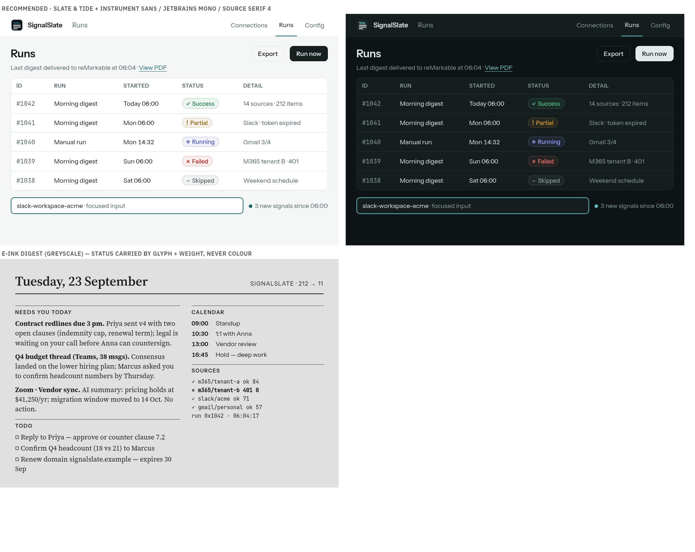

---
citations:
  - url: "https://dev.to/alanwest/why-every-ai-built-website-looks-the-same-blame-tailwinds-indigo-500-3h2p"
    title: "Why Every AI-Built Website Looks the Same (Blame Tailwind's Indigo-500)"
    pub_date: "2025"
    fetched_ts: "2026-09-23T03:30:00Z"
    claimed_span: "Tailwind UI's bg-indigo-500 default blamed for ubiquitous indigo/purple AI-generated UIs; Tailwind creator apologised Aug 2025"
    status: LIVE
  - url: "https://prg.sh/ramblings/Why-Your-AI-Keeps-Building-the-Same-Purple-Gradient-Website"
    title: "Why Your AI Keeps Building the Same Purple Gradient Website"
    pub_date: "2025"
    fetched_ts: "2026-09-23T03:30:00Z"
    claimed_span: "indigo/purple defaults self-reinforce through training data"
    status: LIVE
  - url: "https://www.925studios.co/blog/ai-slop-design-tells"
    title: "AI Slop Fonts and Gradients: The Tells That Give Away AI Design"
    pub_date: "2025"
    fetched_ts: "2026-09-23T03:30:00Z"
    claimed_span: "indigo/violet gradients and default fonts listed as AI-design tells"
    status: LIVE
  - url: "https://www.claudecodehq.com/playbooks/unslop-ui"
    title: "Unslop UI: Kill the AI Design Tells"
    pub_date: "2026-09"
    fetched_ts: "2026-09-23T03:30:00Z"
    claimed_span: "cream background + serif + sage accent emerging as the next generic 'tasteful default'"
    status: LIVE
  - url: "https://tailwindcss.com/docs/colors"
    title: "Colors - Tailwind CSS"
    pub_date: "2025"
    fetched_ts: "2026-09-23T03:30:00Z"
    claimed_span: "Tailwind v4 palette defined in oklch() and exposed as --color-* CSS variables"
    status: LIVE
  - url: "https://www.radix-ui.com/colors/docs/palette-composition/understanding-the-scale"
    title: "Understanding the scale — Radix Colors"
    pub_date: "unknown"
    fetched_ts: "2026-09-23T03:50:00Z"
    claimed_span: "Steps 1-2 app/subtle backgrounds, 3-5 component states, 6-8 borders, 9-10 solid backgrounds, 11-12 text; per-mode aliases recommended"
    status: LIVE
  - url: "https://git.apcacontrast.com/documentation/APCA_in_a_Nutshell.html"
    title: "APCA in a Nutshell"
    pub_date: "unknown"
    fetched_ts: "2026-09-23T03:30:00Z"
    claimed_span: "APCA Lc scale; Lc 90 preferred for body text, Lc 15 near invisibility"
    status: LIVE
  - url: "https://web.dev/articles/color-and-contrast-accessibility"
    title: "Color and contrast accessibility"
    pub_date: "unknown"
    fetched_ts: "2026-09-23T03:30:00Z"
    claimed_span: "WCAG 2 contrast ratios remain the shipped baseline"
    status: LIVE
  - url: "https://medium.com/@courtneyjordan/designing-color-blind-accessible-dashboards-ba3e0084be82"
    title: "Designing color-blind accessible dashboards"
    pub_date: "unknown"
    fetched_ts: "2026-09-23T03:30:00Z"
    claimed_span: "never rely on hue alone; pair status colour with icon/text; badges need 4.5:1"
    status: LIVE
  - url: "https://www.rs999.in/blog/halation-bloom-in-dark-mode-graphics-why-your-white-text-vibrates-on-black-and-the-anti-glow-fix-pros-use"
    title: "Halation in Dark-Mode Design"
    pub_date: "2025"
    fetched_ts: "2026-09-23T03:30:00Z"
    claimed_span: "avoid pure black; desaturate accents 10-20% for dark mode to prevent vibration"
    status: LIVE
  - url: "https://github.com/vercel/geist-font/issues/81"
    title: "Dotted zeros instead of slashed zeros · vercel/geist-font#81"
    pub_date: "unknown"
    fetched_ts: null
    claimed_span: "Geist zero glyph/feature confusion"
    status: NOT_FETCHED
  - url: "https://fonts.google.com/specimen/Literata"
    title: "Literata - Google Fonts"
    pub_date: "unknown"
    fetched_ts: null
    claimed_span: "Literata designed for e-reading (Google Play Books)"
    status: NOT_FETCHED
  - url: "https://github.com/googlefonts/literata"
    title: "googlefonts/literata"
    pub_date: "unknown"
    fetched_ts: null
    claimed_span: "variable Literata source, OFL"
    status: NOT_FETCHED
  - url: "https://fonts.nuxt.com/get-started/providers"
    title: "Providers - Nuxt Fonts"
    pub_date: "unknown"
    fetched_ts: null
    claimed_span: "local provider for self-hosted font files; default google provider fetches remotely"
    status: NOT_FETCHED
  - url: "https://github.com/google/fonts/tree/main/ofl"
    title: "google/fonts — OFL directory (font binaries inspected with fontTools)"
    pub_date: "2026-09"
    fetched_ts: "2026-09-23T03:34:00Z"
    claimed_span: "16 candidate TTFs downloaded; GSUB features, axes, x-height, figure widths measured locally"
    status: LIVE
---

# Research: SignalSlate design system — colour, type, tokens

**Date**: 2026-09-23
**Type**: Comparison (+ simulated persona panel)
**Status**: Complete
**Stack**: Nuxt 3 + Quasar (`nuxt-quasar-ui`) console in `web/`; Python pipeline (`pipeline/`), PDF digest renderer not yet built (Phase 4)

---

## Summary

SignalSlate should move from "indigo on slate + Roboto" to **Slate & Tide**. The base is a cool, faintly teal-tinted slate with **ink-black primary buttons**. A deep sea-teal accent is reserved for the *signal*: the logo wave, focus rings, links, active navigation and "new" markers. Type becomes **Instrument Sans** (UI; already the wordmark face), **JetBrains Mono** (IDs, logs, JSON) and **Source Serif 4** (the e-ink/PDF digest).

We rendered four palettes and four font pairings as real UI and digest specimens. A panel of five simulated personas then scored them.
- **Palettes:** Ink scored highest overall (39/50) and Tide took the most first picks (3 of 5). The recommendation combines them.
- **Fonts:** F3 was top pick for 3 of 5 personas and tied first on digest reading.

Contrast measurement also found a defect in the *current* palette: the warning, positive and info colours fail WCAG AA as chip text. The proposed tokens pass all 32 checks.

Separately, every palette's status colours collapse to the same grey on a greyscale reMarkable. The digest must therefore carry status through glyph and weight, never through colour.



---

## Research Questions

### Q1: What colour personality fits SignalSlate, and is the current indigo right?
**Answer**: Indigo is the weakest fit. Three dated sources call indigo/violet the signature "AI-generated SaaS" tell, rooted in Tailwind's `indigo-500` default; its creator publicly apologised for that default in Aug 2025 (dev.to; prg.sh; 925studios). That look contradicts the calm, "not another dashboard" personality. The personas agreed: they scored P1 Refined Indigo 30/50, second-lowest ("Series A startup", "Linear's little cousin"). A deep sea-teal accent on slate, with ink-black primary actions, scored best and ties the colour to the logo's wave.

### Q2: Which fonts for console, monospace, and the e-ink digest?
**Answer**:
- **UI:** Instrument Sans. It already sets the wordmark, and its binary has `tnum` plus 12 stylistic sets.
- **Mono:** JetBrains Mono. It has a `zero` feature and tabular default figures; Ravi scored it best for IDs.
- **Digest:** Source Serif 4. It has an `opsz` 8–60 axis and tabular default figures, and tied first on digest reading (39/50).

The personas preferred this set 3 of 5 times.

### Q3: Do status colours survive e-ink / colour-vision deficiency?
**Answer**: No, not by hue. Measured CIE L\* of all four status colours sits in a 1–2 L\* band for every candidate palette (`research/color-metrics`, §Findings). On a greyscale reMarkable they are the same grey. Colour-vision-deficiency guidance says never to use hue alone. The console already pairs every chip with icon + label (`web/DESIGN.md` §Status chips), and that rule is the load-bearing one. The digest must use glyphs (✓ ✕ !) and weight, never colour.

### Q4: How should tokens be structured?
**Answer**: Tokens should come in two layers.
- **Raw scales:** OKLCH or hex steps, as Radix 12-step role scales and Tailwind v4 do.
- **Semantic tokens** on top: `--ss-bg`, `--ss-surface`, `--ss-border`, `--ss-text`, `--ss-muted`, `--ss-primary`, `--ss-accent`, plus status tokens. Each has a light/dark pair.

Quasar brand keys (`primary`, `positive`, …) map onto the semantic layer. Components already use semantic Quasar names, not hex: 147 class usages and `web/utils/status.ts`. A palette swap is therefore mostly config.

### Q5: How do fonts get to a LAN-only deployment and the PDF renderer?
**Answer**: Self-host the fonts. Two routes work:
- `@fontsource-variable/*` npm packages (the same pattern as today's `@quasar/extras` Roboto).
- `@nuxt/fonts` with the **local** provider only. Its default Google provider fetches remotely at build time.

Drop `extras.font: 'roboto-font'` and set Quasar's `$typography-font-family`. The Phase 4 PDF renderer embeds the same OFL TTFs, either with fpdf2 `add_font`, which is already a dependency (`requirements.txt`), or with an HTML→PDF engine.

### Q6: Should the wordmark font change?
**Answer**: No. If Instrument Sans becomes the UI face, the wordmark belongs to the UI family, which resolves Elise's cohesion objection. Her remaining critique, that the wordmark "reads as default UI font, just bigger", is addressed by optical kerning of the outlined lockup, not by a new face (§Dissent).

---

## Findings

### Colour — market and counter-evidence

- **Indigo fatigue:** indigo/violet is widely identified as an AI-design tell. Tailwind's creator apologised for `indigo-500` in Aug 2025 (dev.to; prg.sh; 925studios). A near-direct hit, since the current accent is `#3F5EFB`.
- **The next cliché:** the "tasteful" escape hatch (cream + serif + sage) is itself flagged as the next generic look by Sept 2026 (claudecodehq unslop-ui). We therefore rejected a visibly cream paper background and a sage accent. The light background stays near-white with a faint cool tint (`#F5F7F7`).
- **Token architecture:** OKLCH-defined scales and 12-step Radix-style role mapping are the convergent standard (tailwindcss.com/docs/colors; Radix "Understanding the scale": steps 1–2 backgrounds, 3–5 component states, 6–8 borders, 9–10 solids, 11–12 text).
- **Dark mode:** avoid pure black (halation) and desaturate accents for dark mode (rs999). The current `#121417` and the proposed `#0E1415` are both in the safe band. Dark-mode accent `#5DBDB9` is lighter and less saturated than its light-mode pair.
- **Contrast standards:** WCAG 2 remains the compliance baseline; APCA is the perceptual successor and useful as a second check (apcacontrast; web.dev).

### Colour — measured (local, reproducible)

WCAG 2 ratios computed from hex values (script in the session scratchpad; reproduced in the §Implementation Sketch check):

| Current token | Use | Ratio on white | AA text (4.5) |
|---|---|---|---|
| warning `#B8860B` | chip text | 3.3 | **FAIL** |
| positive `#1F8A5E` | chip text | 4.3 | **FAIL** |
| info `#3E7CB1` | chip text | 4.4 | **FAIL** |
| negative `#C4392B` | chip text | 5.3 | pass |

Greyscale separation (CIE L\*), current palette: negative 45 / info 50 / positive 51 / warning 59. The minimum gap is 1; e-ink needs roughly 15 or more to tell colours apart. Every candidate showed the same collapse (gap 1). Status colour is unusable as a signal on the reMarkable.

Proposed Slate & Tide tokens: **32/32 checks pass**. That covers text/bg, muted/surfaces, primary, accent (text and non-text), links, logo wave on tile, and every status on white, on dark surface, and on an 8% chip tint.

### Typography — measured from font binaries

Downloaded the 16 candidate variable TTFs from `google/fonts` and inspected them with fontTools (GSUB features, axes, OS/2 metrics, digit advance widths):

| Font | Axes | `tnum` | `zero` | Default figures | x-height/UPM |
|---|---|---|---|---|---|
| Instrument Sans | wdth 75–100, wght 400–700 | Y | – | proportional | 0.510 |
| Geist | wght 100–900 | Y | – | proportional | 0.530 |
| IBM Plex Sans | wdth, wght 100–700 | (n/a) | Y | **tabular** | 0.516 |
| Schibsted Grotesk | wght 400–900 | Y | Y | proportional | 0.527 |
| JetBrains Mono | wght 100–800 | – | Y | tabular | 0.550 |
| Geist Mono | wght 100–900 | – | – | tabular | 0.530 |
| IBM Plex Mono | static | – | Y | tabular | 0.516 |
| Source Serif 4 | opsz 8–60, wght 200–900 | Y | Y | **tabular** | 0.475 |
| Literata | opsz 7–72, wght 200–900 | Y | Y | proportional | 0.507 |
| Newsreader | opsz 6–72, wght 200–800 | Y | – | tabular | **0.426** |

Implications:
- **Tabular numbers:** Instrument Sans needs `font-variant-numeric: tabular-nums` on tables, times and counts; its default figures are proportional.
- **Slashed zero:** Geist has no `zero` feature, which confirms the zero-glyph complaint in geist-font#81. IDs and hex go to JetBrains Mono, which has one.
- **Newsreader:** its x-height (0.426) is the smallest of the digest faces. That backs Jonah's "bold disappears" and matters for presbyopic readers, even though Margaret and Elise loved it.
- **Literata:** purpose-built for e-reading (Google Play Books) with the largest serif x-height. It is the documented runner-up digest face.

### Codebase inventory (`codebase-analyst`)

- Hex values live in 4 files (19 occurrences): `web/nuxt.config.ts` (brand), `web/assets/css/app.scss` (surfaces), plus inline duplicates in `web/pages/config.vue:315-316` and `web/components/JobsProfilePanel.vue:795-796`. Command: `grep -rEon "#[0-9a-fA-F]{3,6}" web --include=*.vue --include=*.ts --include=*.scss`.
- 147 Quasar semantic colour-class usages (`text-positive`, `bg-grey-2`, …) resolve through brand variables and re-theme automatically.
- `web/utils/status.ts` maps states to semantic names, not hex. `web/tests/status.test.ts` and `web/tests/OAuthDialog.test.ts` assert names, so they survive a re-palette.
- Dark-mode brand pairs listed in `web/DESIGN.md` are **not wired**: `nuxt.config.ts` brand has single values, so dark mode reuses light-mode brand hexes. The design system must fix this with CSS-variable overrides under `body.body--dark`.
- Header uses Quasar default `bg-primary` (`web/layouts/default.vue:103`). With ink primary, the header becomes near-black: an intentional look, but verify it.
- No digest PDF renderer exists; only `pipeline/jobs/packet.py:174` (fpdf2 cover letter, Helvetica). Digest typography is greenfield.

### Persona panel (simulated, n=5, independent agents viewing rendered PNGs)

Each persona viewed identical specimens (`assets/2026-09-23_design-system/palette-P*.png`, `fonts-F*.png`) and scored them without seeing the others.

| Persona | Profile | P1 Indigo | P2 Tide | P3 Ink | P4 Marigold | Top pick |
|---|---|---|---|---|---|---|
| Dana | owner-operator, reMarkable at 6:30, weekly console | 6 | 8 | 9 | 4 | P2 + F3 |
| Ravi | homelab, always dark, Linear/Grafana taste | 6 | 8 | 7 | 5 | P2 + F3 |
| Margaret | 58, presbyopia, light mode, non-technical | 7 | 7 | 8 | 6 | P3 + F4 |
| Jonah | SRE, deuteranomaly | 6 | 5 | 8 | 7 | P3 + F2 |
| Elise | brand/type designer, e-ink reader | 5 | 8 | 7 | 6 | P2 + F3 |
| **Sum /50** | | 30 | 36 | **39** | 28 | P2×3, P3×2 |

| Font set (console / digest) | Dana | Ravi | Margaret | Jonah | Elise | Sum console | Sum digest |
|---|---|---|---|---|---|---|---|
| F1 Geist / Geist Mono / Literata | 7/8 | 8/7 | 7/8 | 8/7 | 6/8 | 36 | 38 |
| F2 IBM Plex ×3 | 6/6 | 8/6 | 7/7 | 8/8 | 6/6 | 35 | 33 |
| **F3 Instrument / JetBrains / Source Serif 4** | 8/9 | 9/8 | 7/7 | 7/7 | 8/8 | **39** | **39** |
| F4 Schibsted / Plex Mono / Newsreader | 7/7 | 7/8 | 8/9 | 7/6 | 7/9 | 36 | 39 |

Convergent themes (≥3 personas):
1. **E-ink status collapse:** status colours becoming the same grey on e-ink is the real dealbreaker (Dana, Ravi, Margaret, Elise, Jonah). Glyph and label must carry status.
2. **P4 marigold** is too loud for primary actions (Dana, Ravi, Margaret).
3. **Indigo** reads generic SaaS (Dana, Ravi, Elise; Margaret: "bank app").
4. **Monospace** for IDs and timestamps is non-negotiable (Dana, Ravi, Jonah).

Hybrid rationale: P3 won on trust and on zero accent/status collision (Jonah, Margaret). P2 won on identity: "the wave finally has a colour that's about water" (Elise), "doesn't look like an AI tool" (Dana). Elise's critique of P3, that monochrome orphans the coloured wave, is answered by keeping teal as the wave and signal colour. Jonah's critique of P2, that a teal primary blurs with info/Running, is answered by making primary ink and moving info to a distinct violet-blue `#4B55B5`.

---

## Compatibility Analysis

### Stack Compatibility

| Aspect | Status | Notes |
|---|---|---|
| Quasar brand config | Compatible | `nuxt.config.ts` `quasar.config.brand` accepts new hexes; dark pairs need CSS vars (`--q-primary` etc.) under `body.body--dark` |
| Fonts, LAN-only | Requires config | `@fontsource-variable/instrument-sans`, `@fontsource-variable/jetbrains-mono`, `@fontsource-variable/source-serif-4`; no CDN at runtime |
| Quasar typography | Requires config | Remove `extras.font: 'roboto-font'`; set `$typography-font-family` via a Quasar SCSS variables file |
| Tests | No conflicts | Tests assert semantic names (`status.test.ts`, `OAuthDialog.test.ts`), not hex |
| PDF digest (Phase 4) | Greenfield | fpdf2 2.8.8 already present, supports `add_font` TTF; same OFL files reused |
| Licences | Compatible | All three families OFL-1.1 (name-table ID 13 checked) |

### Integration Complexity

- **Effort estimate**: Medium (1–2 days) for the console; the digest template is scoped into Phase 4.
- **Files affected**: about 8. `web/nuxt.config.ts`, `web/assets/css/app.scss`, new `web/assets/css/quasar.variables.scss`, `web/DESIGN.md`, `web/pages/config.vue`, `web/components/JobsProfilePanel.vue`, `web/layouts/default.vue`, `web/public/logo*.svg` / favicon PNGs, `web/package.json`.
- **Breaking changes**: No API changes. Visual only.
- **Migration path**: tokens first, then fonts, then assets, then removing the inline hexes.

---

## Recommendation

### Decision

Adopt **Slate & Tide** colour tokens and the **Instrument Sans / JetBrains Mono / Source Serif 4** type stack as the SignalSlate design system. Primary actions are ink; the teal accent is reserved for signal/interactive chrome and never used on status chips. Status is always glyph + label, and in the digest glyph + weight only. Update `web/DESIGN.md` as the source of truth and recolour the logo wave to Tide.

#### Tokens

| Token | Light | Dark | Role |
|---|---|---|---|
| `--ss-bg` | `#F5F7F7` | `#0E1415` | page |
| `--ss-surface` | `#FFFFFF` | `#151D1F` | cards, header |
| `--ss-surface-2` | `#EEF2F2` | `#1C2628` | table header, hover |
| `--ss-border` | `#DCE3E3` | `#27322F` | 1px separation (borders not shadows) |
| `--ss-text` | `#111718` | `#E2EAEA` | body |
| `--ss-muted` | `#526265` | `#8C9D9F` | secondary text (≥5.4:1) |
| `--ss-primary` / Quasar `primary` | `#18201F` | `#E2EAEA` | primary buttons (ink; inverts in dark) |
| `--ss-on-primary` | `#FFFFFF` | `#0E1415` | text on primary |
| `--ss-accent` / Quasar `accent` | `#1B6668` | `#5DBDB9` | focus ring, active nav, links, selection, "new" dot |
| `--ss-accent-subtle` | `#E2EFEE` | `#173335` | selected row, accent chip bg |
| `--ss-link` | `#1B6668` | `#7FCFCB` | inline links (underlined) |
| logo wave | `#4DB3AF` on `#111718` tile | `#5DBDB9` on `#1C2628` tile | brand mark |
| `positive` | `#1B7A4B` | `#5CC98F` | ✓ Success |
| `negative` | `#B3261E` | `#F2796D` | ✕ Failed |
| `warning` | `#8A5A00` | `#E3A63B` | ! Partial |
| `info` | `#4B55B5` | `#9AA4FF` | ◷ Running |

#### Type

| Role | Family | Settings |
|---|---|---|
| UI | Instrument Sans (variable, wght 400–700) | 400 body, 500 labels/buttons, 600 headings; `tabular-nums` on tables, times, counts; headings `letter-spacing: -0.015em` |
| Mono | JetBrains Mono (variable) | IDs, run numbers, JSON, logs; `font-feature-settings: "zero" 1` |
| Digest | Source Serif 4 (variable, `opsz` auto) | body 11–12pt; emphasis at wght 650–700, not 600 (Jonah: weight jump must survive e-ink); section labels in Instrument Sans 600 caps +0.12em |
| Wordmark | Instrument Sans SemiBold, outlined | unchanged; optical kerning pass |

The scale stays as in `web/DESIGN.md` (12/14/16/20/24).

### Rationale

- **Highest combined persona score:** it merges the top-scoring palette (P3 Ink, 39/50: trust, no accent/status collision) with the most-picked one (P2 Tide, 3/5: distinct identity, wave coherence).
- **No indigo:** it steps out of the evidenced AI-SaaS indigo cliché without jumping into the next one (cream + sage).
- **Fixes a real accessibility defect:** 3 current status colours fail AA as text. All 32 proposed checks pass.
- **One family from logo to UI:** Instrument Sans ties the wordmark and UI into one family, JetBrains Mono gives the slashed zero Geist lacks, and Source Serif 4 has tabular figures by default for digest times plus an optical-size axis for e-ink.
- **Low migration risk:** status mapping is already semantic, tests assert names, and hex values sit in 4 files.

### Comparison Matrix

| Criteria | Slate & Tide (rec.) | P3 Ink | P2 Tide | P1 Indigo | P4 Marigold |
|---|---|---|---|---|---|
| Persona score | hybrid of top two | 39 | 36 | 30 | 28 |
| Accent vs status collision | none (ink primary, violet info) | none | teal ↔ info/positive | indigo ↔ info | marigold ↔ warning |
| Logo-wave coherence | strong | weak (orphaned wave) | strong | medium | medium |
| AI-cliché risk | low | low | low | **high** | low |
| AA status text | 32/32 pass | 3 fail (current status set) | pass | 3 fail | pass |
| **Overall** | **Recommended** | Acceptable | Acceptable | Not recommended | Not recommended |

---

## Implementation Sketch

### Step 1: Token layer (`web/assets/css/app.scss`)

```scss
body.body--light {
  --ss-bg: #F5F7F7; --ss-surface: #FFFFFF; --ss-surface-2: #EEF2F2; --ss-border: #DCE3E3;
  --ss-text: #111718; --ss-muted: #526265; --ss-accent: #1B6668; --ss-accent-subtle: #E2EFEE;
}
body.body--dark {
  --ss-bg: #0E1415; --ss-surface: #151D1F; --ss-surface-2: #1C2628; --ss-border: #27322F;
  --ss-text: #E2EAEA; --ss-muted: #8C9D9F; --ss-accent: #5DBDB9; --ss-accent-subtle: #173335;
  // wire the dark brand pairs DESIGN.md documents but nuxt.config cannot express
  --q-primary: #E2EAEA; --q-accent: #5DBDB9; --q-positive: #5CC98F;
  --q-negative: #F2796D; --q-warning: #E3A63B; --q-info: #9AA4FF;
}
```

Rename existing `--ss-surface-bg` / `--ss-surface-card` to the new names. Replace the inline hexes in `web/pages/config.vue:315-316` and `web/components/JobsProfilePanel.vue:795-796` with `var(--ss-surface-2)` / `var(--ss-border)`.

### Step 2: Quasar brand + fonts (`web/nuxt.config.ts`)

```ts
quasar: {
  extras: { fontIcons: ['material-icons'] },          // drop 'roboto-font'
  config: { dark: 'auto', brand: {
    primary: '#18201F', secondary: '#526265', accent: '#1B6668',
    positive: '#1B7A4B', negative: '#B3261E', warning: '#8A5A00', info: '#4B55B5',
    dark: '#151D1F', 'dark-page': '#0E1415' } },
},
css: ['@fontsource-variable/instrument-sans', '@fontsource-variable/jetbrains-mono', '~/assets/css/app.scss'],
```

Add a Quasar SCSS variables file with `$typography-font-family: 'Instrument Sans Variable', system-ui, sans-serif`. Add `.q-table td, time, .num { font-variant-numeric: tabular-nums }` and a `.mono` class (`'JetBrains Mono Variable'`, `"zero" 1`).

`npm i @fontsource-variable/instrument-sans @fontsource-variable/jetbrains-mono @fontsource-variable/source-serif-4`.

### Step 3: Header, logo, favicon

- **Header:** `web/layouts/default.vue` `q-header` becomes surface + bottom border (`class="bg-surface text-body"` via token) instead of an ink/primary fill, keeping the header calm. Active nav gets a 2px `--ss-accent` underline.
- **Logo:** recolour the wave in `web/public/logo.svg`, `favicon.svg` and both lockups from `#3F5EFB`/`#5B7CFF` to `#4DB3AF`. The lockup "slate" grey becomes `#526265` light / `#8C9D9F` dark. Re-rasterise the PNG/ICO.

### Step 4: Docs + guardrails

- Rewrite `web/DESIGN.md` §Palette and §Typography with the tables above.
- Add these rules:
  - accent never on status chips;
  - primary is ink;
  - digest status = glyph + weight.
- Add a vitest that parses brand/token hexes and asserts WCAG ≥4.5 for status and muted text on the surfaces. Outcome-based: "every status token passes AA on surface and dark surface".

### Step 5: Digest (Phase 4)

- **Colour:** no colour at all. Status glyphs ✓ ✕ ! in the mono column, and failed rows in bold.
- **Type:** Source Serif 4 body; labels in Instrument Sans caps.
- **Fonts:** embed the TTFs from `google/fonts` (or fontsource `files/`) via fpdf2 `add_font`.

### Configuration Changes

- `web/package.json`: +3 `@fontsource-variable/*` dependencies, −reliance on the `@quasar/extras` Roboto font.
- `web/nuxt.config.ts`: brand hexes, `extras.font` removed, font CSS imports.
- Dockerfile: no change (fonts are bundled by Vite from `node_modules`).

---

## Risks

| Risk | Likelihood | Impact | Mitigation |
|---|---|---|---|
| Ink primary makes the Quasar header near-black when it uses `bg-primary` | High | Medium | Step 3 moves the header to surface + border; check every `color="primary"` usage (147 class usages to spot-check) |
| Teal accent read as a status colour by CVD users (Jonah) | Medium | Medium | Accent never on chips or badges; chips always icon + label; info moved to violet-blue `#4B55B5` |
| Instrument Sans proportional figures misalign tables | High (if forgotten) | Low | Global `tabular-nums` on `.q-table` and times; the vitest guard can't catch this, so add it to DESIGN.md |
| Persona panel is simulated, not real users | Certain | Medium | Treat scores as structured heuristic review, not user research; validate with the actual owner on a real reMarkable print before Phase 4 locks the digest face |
| Source Serif 4 bold too close to regular on e-ink (Jonah) | Medium | Medium | Emphasis at wght 650–700; print a test page on the device; Literata is the fallback (largest x-height, e-reading brief) |
| Dark brand pairs silently not applied (current bug) | Already present | Low | CSS `--q-*` overrides under `body.body--dark` (Step 1) |

### Open Questions

- The ink-primary header versus a surface header is a taste call. Step 3 recommends surface; confirm on the rendered console.
- No source settled "paper off-white vs white" for all-day consoles (web-researcher gap). The choice of a faintly tinted `#F5F7F7` is judgement, not evidence.
- The reMarkable Paper Pro colour e-ink (Canvas Color) was not tested. Would a single teal accent in the digest help there, or is greyscale-only simpler? Recommend greyscale-only until tested.
- Elise (dissent) wants a bespoke wordmark treatment. Deferred: the lockup exists and is coherent with the UI once Instrument Sans is the UI face.

---

## Dissent / Contradictory Evidence

- **Margaret and Jonah preferred pure P3 Ink**, a monochrome console with only a cobalt link. The hybrid keeps their core demand (ink primary, no accent/status collision) but reintroduces teal chrome they didn't ask for. Margaret did want "a touch of confident colour on the one button I press"; the hybrid gives that colour to focus and links, not the button.
- **Digest face is contested.** Margaret (9) and Elise (9) rated Newsreader the best digest serif ("closest to a well-set newspaper page"). Jonah rated it worst (6: bold emphasis disappears on greyscale). Measured x-height supports Jonah: Newsreader has the smallest x-height of all serif candidates (0.426). Source Serif 4 tied on total score (39) with less variance. Newsreader remains a legitimate alternative if the owner prefers an editorial feel.
- **Elise wanted Schibsted Grotesk as the UI face** and a new wordmark. Other personas rated Schibsted's console "more attitude than I want" (Dana) and "editorial magazine" (Ravi). Instrument Sans kept the higher console score (39 vs 36).
- **Ravi preferred Literata** for the digest, and Jonah rated Plex Serif's bold contrast best. Both are recorded as fallbacks.
- **The contrarian researcher flagged that sage/cream is the next cliché.** Teal sits near that region. The hybrid avoids the cream background and uses a deep, saturated sea-teal (`#1B6668`), not a desaturated sage, but the distance is a matter of degree.
- **Single-domain caution:** the "indigo is AI slop" evidence comes from design-blog and commentary sources only (dev.to, prg.sh, 925studios, claudecodehq), with no user study. The personas corroborated it independently (3 of 5), but treat it as a style consensus, not measured fact.

---

## Citation Health

research-critic probe 2026-09-23 → initial verdict CITATIONS_MISSING (1 ungrounded span: Radix role-mapping claim cited a Tailwind wrapper repo). Fixed: replaced with official Radix docs, re-fetched and confirmed. 13 LIVE, 2 UNKNOWN (medium.com, fonts.google.com — bot-blocked, not dead), 0 DEAD, 0 LIKELY_HALLUCINATED.

| URL | Status |
|---|---|
| dev.to …indigo-500 | LIVE |
| prg.sh …purple-gradient | LIVE |
| 925studios.co …ai-slop-design-tells | LIVE |
| claudecodehq.com/playbooks/unslop-ui | LIVE |
| tailwindcss.com/docs/colors | LIVE |
| radix-ui.com …understanding-the-scale | LIVE (re-fetched after fix) |
| git.apcacontrast.com …APCA_in_a_Nutshell | LIVE |
| web.dev …color-and-contrast-accessibility | LIVE |
| medium.com/@courtneyjordan … | UNKNOWN |
| rs999.in …halation | LIVE |
| github.com/vercel/geist-font/issues/81 | LIVE |
| fonts.google.com/specimen/Literata | UNKNOWN |
| github.com/googlefonts/literata | LIVE |
| fonts.nuxt.com/get-started/providers | LIVE |
| github.com/google/fonts/tree/main/ofl | LIVE |

---

## References

1. Why Every AI-Built Website Looks the Same (Blame Tailwind's Indigo-500) — https://dev.to/alanwest/why-every-ai-built-website-looks-the-same-blame-tailwinds-indigo-500-3h2p — indigo default and apology
2. Why Your AI Keeps Building the Same Purple Gradient Website — https://prg.sh/ramblings/Why-Your-AI-Keeps-Building-the-Same-Purple-Gradient-Website — training-data feedback loop
3. AI Slop Fonts and Gradients — https://www.925studios.co/blog/ai-slop-design-tells — design tells taxonomy
4. Unslop UI — https://www.claudecodehq.com/playbooks/unslop-ui — cream/serif/sage as the emerging cliché
5. Tailwind CSS Colors — https://tailwindcss.com/docs/colors — OKLCH palette and CSS variables
6. Understanding the scale — Radix Colors — https://www.radix-ui.com/colors/docs/palette-composition/understanding-the-scale — 12-step role scales
7. APCA in a Nutshell — https://git.apcacontrast.com/documentation/APCA_in_a_Nutshell.html — perceptual contrast
8. Color and contrast accessibility — https://web.dev/articles/color-and-contrast-accessibility — WCAG baseline
9. Designing color-blind accessible dashboards — https://medium.com/@courtneyjordan/designing-color-blind-accessible-dashboards-ba3e0084be82 — hue-independent status
10. Halation in Dark-Mode Design — https://www.rs999.in/blog/halation-bloom-in-dark-mode-graphics-why-your-white-text-vibrates-on-black-and-the-anti-glow-fix-pros-use — dark-mode accent desaturation
11. vercel/geist-font#81 — https://github.com/vercel/geist-font/issues/81 — Geist zero glyph
12. Literata — https://fonts.google.com/specimen/Literata and https://github.com/googlefonts/literata — e-reading serif
13. Nuxt Fonts providers — https://fonts.nuxt.com/get-started/providers — local provider for LAN-only
14. google/fonts OFL — https://github.com/google/fonts/tree/main/ofl — font binaries inspected locally
15. `web/DESIGN.md`, `web/nuxt.config.ts:17-29`, `web/assets/css/app.scss`, `web/utils/status.ts`, `web/layouts/default.vue:103-108`, `pipeline/jobs/packet.py:174` — current system
16. Specimens and persona inputs — `docs/_research/assets/2026-09-23_design-system/*.png`
